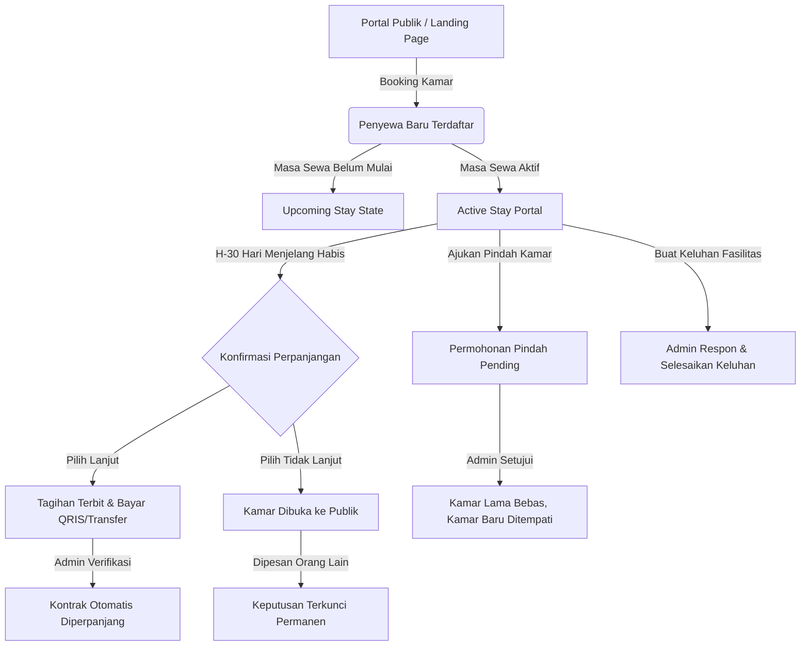

# 🏡 Sekar Space — Sistem Informasi & Manajemen Hunian Kost Muslimah

**Sekar Space** adalah platform aplikasi web manajemen kost modern yang dirancang khusus untuk memenuhi kebutuhan operasional pemilik kost dan memberikan pengalaman digital hunian yang prima bagi penyewa (*tenant*).

Aplikasi ini mencakup **Portal Publik / Landing Page**, **Portal Mandiri Penyewa (*Tenant Self-Service Portal*)**, dan **Panel Kontrol Pengelola (*Admin Management Portal*)**.

---

## 🛠️ Teknologi yang Digunakan (Tech Stack)

- **Frontend Framework:** [Vue 3](https://vuejs.org/) (Composition API & `<script setup>`)
- **Bahasa Pemrograman:** [TypeScript](https://www.typescriptlang.org/)
- **Build Tool & Bundler:** [Vite](https://vitejs.dev/)
- **Routing:** [Vue Router 4](https://router.vuejs.org/)
- **Styling:** Vanilla CSS Modern (Design Tokens, Responsive Grid & Flexbox, Glassmorphism, Micro-animations)
- **Icons:** [Boxicons](https://boxicons.com/)
- **Database State:** JSON Relasional Terstruktur (`src/data/`) dengan sinkronisasi reaktif `localStorage`.

---

## 👥 Kredensial Akun Demo (Demo Accounts)

Untuk mempermudah pengujian dan demonstrasi sistem di berbagai kondisi hunian, telah disediakan akun-akun terstandarisasi sebagai berikut:

| Peran / Skenario | Username | Password | Nama Pengguna | Kamar Ditempati | Kondisi Pengujian |
| :--- | :--- | :--- | :--- | :--- | :--- |
| **👑 Pengelola Admin** | `admin` | `admin123` | **Pengelola Admin** | — | Akses penuh: verifikasi tagihan, persetujuan pindah kamar, tanggapan keluhan, kelola kamar & CMS. |
| **🔔 H-30 Warning** | `febri` | `123` | **Febriyanti Putri** | Kamar **B12** | Jatuh tempo 15 Sep 2026. Muncul banner/modal konfirmasi lanjut sewa atau pindah kamar. |
| **⏳ H-7 Countdown & Bayar** | `zalfa` | `user123` | **Zalfa Nadya Alfialini** | Kamar **A12** | Jatuh tempo 23 Agu 2026 (Sisa 7 Hari). Status sewa perpanjangan aktif dengan tagihan `pending` (siap demo bayar). |
| **✅ Lanjut & Lunas** | `keyla` | `user123` | **Keyla Asyfa Zahra** | Kamar **A13** | Perpanjangan 6 bulan telah lunas dan terverifikasi admin. Kontrak sewa aktif aman. |
| **❌ Tidak Lanjut & Terkunci** | `zulfa` | `user123` | **Zulfa Tsaniyatul Fadilah** | Kamar **A11** | Memilih *tidak lanjut*. Kamar sudah dibooking Nabila sehingga tombol ubah keputusan terkunci otomatis. |
| **📅 Calon Penyewa (Upcoming)** | `nabila` | `123` | **Nabila Eka Safitri** | Kamar **A11** *(Mulai 17 Sep 2026)* | Booking lunas. Masa sewa aktif di masa depan. Fitur komplain/bayar dinonaktifkan secara aman. |
| **🏡 Normal / Mid-Stay** | `dinda` | `123` | **Adinda Rahmawati** | Kamar **C13** | Sisa sewa 4,5 bulan. Memiliki riwayat komplain fasilitas berstatus `in-progress`. |

---

## 🧪 Skenario Pengujian Kelayakan Sistem (Testing Flows)

Berikut adalah panduan langkah demi langkah (*test cases*) untuk menguji seluruh fitur dan alur bisnis sistem:



---

### Skenario 1: Peringatan Konfirmasi Perpanjangan Sewa (H-30 Hari)
> **Tujuan:** Memastikan penyewa yang masa sewanya tersisa $\le 30$ hari mendapatkan notifikasi pengingat untuk menentukan kelanjutan sewa.

1. Login sebagai penyewa **`febri`** (Password: `123`).
2. Masuk ke halaman **Dashboard Penyewa**.
3. **Ekspektasi Sistem:**
   - Muncul banner peringatan konfirmasi perpanjangan sewa (Kamar B12 berakhir pada 15 September 2026).
   - Terdapat tombol pilihan: **"Lanjut Sewa"**, **"Tidak Lanjut"**, atau **"Pindah Kamar"**.
   - Jika memilih *"Lanjut Sewa"*, sistem mencatat `extensionIntent = 'extend'`.
   - Jika memilih *"Tidak Lanjut"*, sistem mencatat `extensionIntent = 'not_extend'` dan membuka ketersediaan kamar ke publik.

---

### Skenario 2: Hitung Mundur Kritis (H-7 Hari) & Pembayaran Tagihan QRIS
> **Tujuan:** Memastikan penghuni yang masa sewanya tinggal 7 hari melihat hitung mundur darurat dan dapat menyelesaikan pembayaran perpanjangan sewa.

1. Login sebagai penyewa **`zalfa`** (Password: `user123`).
2. Perhatikan kartu **Hitung Mundur Jatuh Tempo** (Sisa waktu 7 hari / 23 Agustus 2026).
3. Buka menu **Tagihan & Bayar** (`/user/payments`).
4. **Ekspektasi Sistem:**
   - Terdapat tagihan aktif berstatus **`Perlu Dibayar (Pending)`** sebesar **Rp 1.800.000**.
   - Klik tombol **"Tampilkan QRIS"** $\rightarrow$ Muncul modal pop-up gambar QRIS resmi Sekar Space dengan tombol unduh QRIS.
   - Unggah bukti transfer pada form pembayaran dan klik **"Kirim Konfirmasi Pembayaran"**.
   - Status tagihan berubah menjadi *"Menunggu Verifikasi Admin"*.
5. Login sebagai **`admin`** (Password: `admin123`) $\rightarrow$ Buka menu **Tagihan & Pembayaran**.
6. Klik **"Lihat Bukti"** $\rightarrow$ Klik **"Konfirmasi Lunas"**.
7. **Ekspektasi Admin:** Tagihan berubah status menjadi `paid (Lunas)` dan kontrak perpanjangan baru otomatis aktif.

---

### Skenario 3: Kamar yang Tidak Lanjut Direservasi Calon Penyewa Lain
> **Tujuan:** Menguji aturan bisnis bahwa ketika penyewa memilih *"Tidak Lanjut"*, kamar akan dibuka untuk booking tanggal mendatang, dan jika sudah ada yang memesan, penyewa lama tidak bisa membatalkan/mengubah keputusan.

1. Login sebagai penyewa **`zulfa`** (Password: `user123`, Kamar A11).
2. Perhatikan bahwa Zulfa telah memilih *"Tidak Melanjutkan Sewa"* (berakhir 16 September 2026).
3. Karena calon penyewa baru (**`nabila`**) telah memesan Kamar A11 untuk tanggal 17 September 2026:
   - Tombol **"Ubah Keputusan"** pada portal Zulfa berstatus **Terkunci / Disabled** dengan keterangan: *"Kamar sudah direservasi oleh calon penyewa baru"*.
4. Buka halaman publik **Pilihan Kamar** (`/rooms`) tanpa login:
   - Kamar **A11** berstatus **`Sudah Direservasi / Terisi`** dan tidak dapat diklik/dipilih oleh publik.

---

### Skenario 4: Calon Penyewa Masa Depan (*Upcoming Stay*)
> **Tujuan:** Memastikan calon penyewa yang tanggal mulai sewanya masih di masa depan tidak dapat membuat keluhan prematur ataupun melihat tagihan aktif yang tidak relevan.

1. Login sebagai penyewa **`nabila`** (Password: `123`).
2. **Ekspektasi Sistem:**
   - Dashboard menampilkan status informasi: *"Masa sewa Anda akan dimulai pada 17 September 2026"*.
   - Menu **Pengaduan Fasilitas** menampilkan informasi proteksi bahwa pengaduan hanya dapat dibuat setelah tanggal sewa aktif.
   - Menu **Tagihan** menampilkan riwayat pemesanan yang telah lunas dan tidak ada tagihan tertunggak.

---

### Skenario 5: Alur Pengajuan & Persetujuan Pindah Kamar (*Room Transfer*)
> **Tujuan:** Menguji alur pengajuan pindah kamar ke unit kosong setipe (Rp 0 Bebas Biaya) yang memerlukan persetujuan pemilik kost.

1. Login sebagai penyewa **`febri`** (Password: `123`, Kamar B12).
2. Di kartu Informasi Kamar, klik tombol **"Pindah Kamar"**.
3. Di modal formulir:
   - Pilih kamar tujuan kosong yang setipe (misal: **Kamar B11 — Gedung B, Lantai 1**).
   - Isi alasan pindah (contoh: *"Ingin lebih dekat dengan pintu masuk utama"*).
   - Klik **"Kirim Pengajuan ke Pengelola"**.
4. **Ekspektasi Penyewa:** Kartu kamar menampilkan status: `⏳ Menunggu Persetujuan Pindah (Ke Kamar B11)`.
5. Login sebagai **`admin`** (Password: `admin123`) $\rightarrow$ Buka menu **Pindah Kamar** (`/admin/room-transfers`).
6. Lihat permohonan dengan nomor tiket `TRF-XXX`.
7. Klik tombol hijau **"Setujui"** $\rightarrow$ Konfirmasi persetujuan.
8. **Ekspektasi Sistem:**
   - Kamar lama (B12) otomatis berstatus `available`.
   - Kamar baru (B11) otomatis berstatus `occupied`.
   - Kontrak sewa Febri dialihkan ke Kamar B11.

---

### Skenario 6: Pengelolaan Keluhan & Kerusakan Fasilitas (*Complaints Flow*)
> **Tujuan:** Menguji pelaporan keluhan oleh penyewa dan penanganan respons oleh admin.

1. Login sebagai penyewa **`dinda`** (Password: `123`, Kamar C13).
2. Buka menu **Keluhan & Pengaduan** (`/user/complaints`).
3. Buat keluhan baru: Kategori *"Fasilitas Kamar"*, Prioritas *"Tinggi"*, Judul *"Lampu Kamar Mandi Redup"*.
4. Klik **"Kirim Keluhan"** $\rightarrow$ Keluhan berstatus `pending`.
5. Login sebagai **`admin`** $\rightarrow$ Buka menu **Keluhan Penyewa** (`/admin/complaints`).
6. Buka detail keluhan $\rightarrow$ Ubah status menjadi `in-progress` dan kirim tanggapan solusi teknisi.
7. Penyewa dapat melihat pembaruan status dan tanggapan admin secara *real-time*.

---

### Skenario 7: Fitur Kirim Pemberitahuan Tagihan via WhatsApp oleh Admin
> **Tujuan:** Menguji otomatisasi pesan WhatsApp pengingat jatuh tempo sewa dengan tarif multi-paket.

1. Login sebagai **`admin`** $\rightarrow$ Buka menu **Tagihan & Pembayaran** (`/admin/payments`).
2. Klik tombol **"Terbitkan Tagihan Baru"** atau klik **"Kirim Tagihan"** pada salah satu penyewa di daftar jatuh tempo.
3. **Ekspektasi Modal:**
   - Jatuh tempo otomatis terisi sesuai tanggal akhir sewa penyewa.
   - Menampilkan rincian tarif otomatis paket 1 Bulan, 3 Bulan, 6 Bulan, dan 12 Bulan sesuai tipe kamar yang ditempati.
4. Klik **"Buka WhatsApp & Kirim Pesan"** $\rightarrow$ Membuka aplikasi/web WhatsApp dengan draf pesan yang rapi dan terstruktur.

---

### Skenario 8: Pengaturan CMS & Landing Page
> **Tujuan:** Memastikan pemilik kost dapat mengatur konten hero, banner pengumuman, fasilitas, serta mengunggah gambar QRIS pembayaran resmi.

1. Login sebagai **`admin`** $\rightarrow$ Buka menu **Kelola Landing Page** (`/admin/cms`).
2. Pada bagian **Metode Pembayaran QRIS**, lakukan upload gambar QRIS baru atau gunakan preset resmi.
3. Ubah teks pengumuman kost pada bagian **Pengumuman Berjalan**.
4. Klik **"Simpan Perubahan CMS"** $\rightarrow$ Buka halaman beranda (`/`) dan portal pembayaran penyewa untuk melihat perubahan instan.

---

## 🚀 Cara Menjalankan Proyek Secara Lokal

### Prasyarat:
- [Node.js](https://nodejs.org/) (Versi 18.x atau lebih baru)
- NPM / Yarn / PNPM

### Langkah Instalasi:

1. **Clone repository atau buka direktori proyek:**
   ```sh
   cd sekar-space
   ```

2. **Install dependensi:**
   ```sh
   npm install
   ```

3. **Jalankan server development lokal:**
   ```sh
   npm run dev
   ```
   Akses aplikasi melalui browser di `http://localhost:5173`.

4. **Validasi & Build Production (Opsional):**
   ```sh
   npm run build
   ```

---

## 📂 Struktur Direktori Proyek

```text
sekar-space/
├── public/
│   └── assets/images/          # Aset statis & gambar QRIS resmi
├── src/
│   ├── components/             # Komponen reusable (Navbar, Footer, Sidebar, Modal)
│   ├── composables/
│   │   ├── useAuth.ts          # State & autentikasi pengguna (Admin & Penyewa)
│   │   └── useDataStore.ts     # State management relasional kamar, sewa, tagihan, komplain
│   ├── data/                   # Basis data JSON terstruktur
│   │   ├── buildings.json      # Data gedung & fasilitas
│   │   ├── rooms.json          # Data kamar & status ketersediaan
│   │   ├── roomTypes.json      # Tipe kamar & tarif sewa paket durasi
│   │   ├── rentals.json        # Kontrak sewa aktif & masa depan
│   │   ├── payments.json       # Data transaksi & tagihan pembayaran
│   │   ├── complaints.json     # Data keluhan penghuni
│   │   ├── users.json          # Akun pengguna terstandarisasi
│   │   └── cms.json            # Konfigurasi konten landing page & QRIS
│   ├── router/
│   │   └── index.ts            # Definisi rute halaman publik, user, dan admin
│   └── views/
│       ├── HomeView.vue        # Landing page publik
│       ├── RoomsView.vue       # Katalog & denah interaktif kamar
│       ├── LoginView.vue       # Halaman login multi-role
│       ├── admin/              # Halaman-halaman panel admin
│       └── user/               # Halaman-halaman portal penyewa
├── package.json
└── README.md
```

---

**Sekar Space** — *Solusi Digital Hunian Kost Muslimah yang Aman, Nyaman, dan Terintegrasi.*
